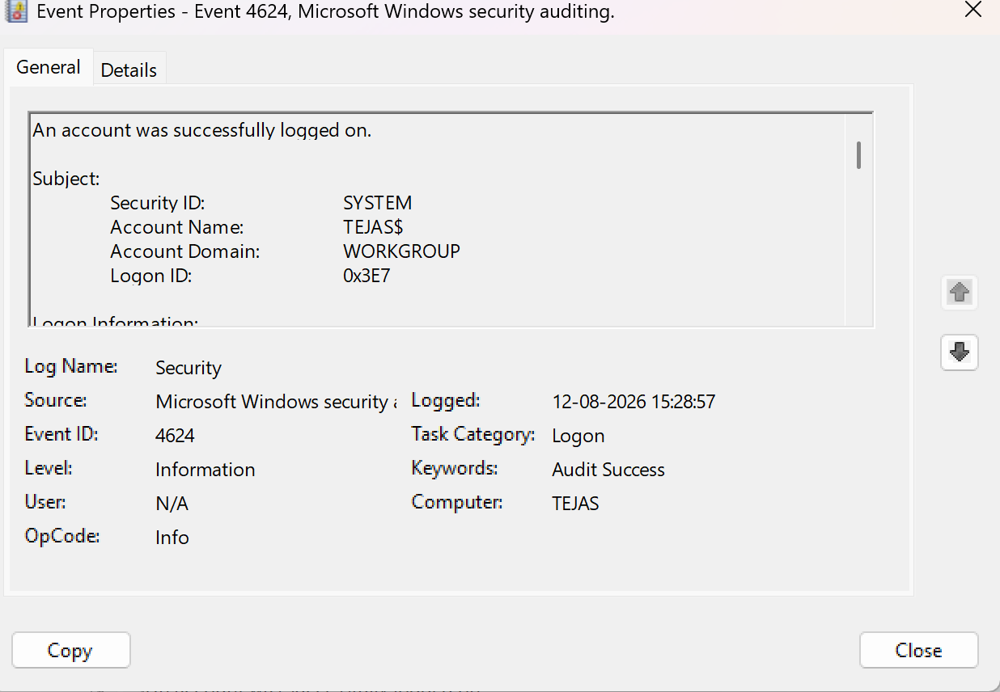

# Investigation 02 — Successful Logon (Event ID 4624)

## Objective
Investigate a successful Windows authentication event and identify
the account, logon type, and authentication details.

## Lab Environment
- OS: Windows
- Log Source: Windows Security Log
- Event ID: 4624
- Tool: Windows Event Viewer

## Scenario
A successful login was performed using the test account in a
controlled Windows lab environment.

## Important Fields
- Account Name:
- Logon Type:
- Workstation Name:
- Source Network Address:
- Timestamp:

## Analysis
Event ID 4624 indicates that a user successfully logged on.

The event should be reviewed together with previous failed
authentication events to determine whether the login was expected.

## Conclusion
The observed event represents a successful authentication.
Additional context is required to determine whether the activity
was legitimate or suspicious.

## Evidence

## Next Investigation
Correlate this event with Event ID 4625 and other security events
around the same timestamp.
