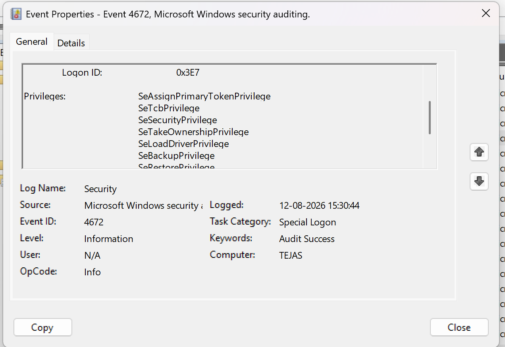

# Investigation 03 — Special Privileges Assigned (Event ID 4672)

## Objective
Investigate privileged activity associated with a Windows logon.

## Lab Environment
- OS: Windows
- Log Source: Windows Security Log
- Event ID: 4672
- Tool: Windows Event Viewer

## Scenario
A privileged account logged into the Windows lab machine.

## Important Fields
- Account Name: TEJAS
- Account Domain: TEJAS
- Privileges: SeAssignPrimaryTokenPrivilege, SeTcbPrivilege, SeSecurityPrivilege, SeTakeOwnershipPrivilege, SeLoadDriverPrivilege, SeBackupPrivilege
- Timestamp:12-08-2026 15:30:44

## Analysis
Event ID 4672 indicates that special privileges were assigned to a
new logon session.

This event is not automatically malicious. Administrators may
legitimately generate this event during normal activity.

## Conclusion
The event represents privileged activity. The account and context
should be verified to determine whether the activity was authorised.

## Evidence

## Next Investigation
Correlate the event with Event ID 4624 and investigate what activity
occurred after the privileged logon.
