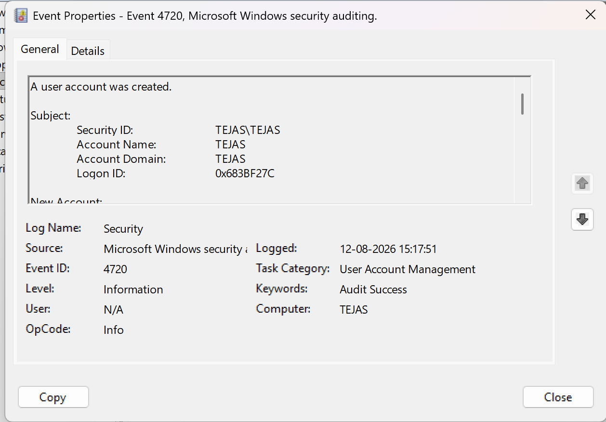

# Investigation 04 — User Account Created (Event ID 4720)

## Objective
Investigate creating a new Windows user account.

## Lab Environment
- OS: Windows
- Log Source: Windows Security Log
- Event ID: 4720
- Tool: Windows Event Viewer

## Scenario
A test user account was intentionally created in the controlled
Windows lab environment.

## Important Fields
- Target Account: TEJAS\soc test
- Account Creator: TEJAS 
- Domain:TEJAS
- Timestamp:12-08-2026 15:17:51

## Analysis
Event ID 4720 indicates that a new user account was created.

Account creation can be legitimate administrative activity, but
unexpected accounts may require further investigation.

## Conclusion
A new test account was successfully created as part of the lab.
The account creator and purpose should always be verified.

## Evidence

## Next Investigation
Check whether the new account was added to any privileged groups
and investigate related account-management events.
